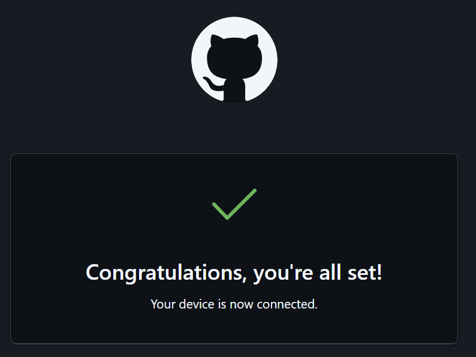

# README 파일이란?

이곳은 *저장소에 대한 설명*을 작성합니다.

**마크다운 문법**을 사용합니다.

## 깃허브 사용법

1. 원격 저장소 만들기
2. 지역 저장소 연결하기
3. 커밋하기
4. 푸시하기
5. 안녕


---

# 제목 1
## 제목2
### 제목 3
1. 안녕
2. 반가워

- 원격
- 저장소
  안녕

- 안녕
-   안녕

`Systemctl start tomcat`

```javascript
<script>
  let now = new Date();
  let display - now.toLocaleTimeString();
  document.write(`현재 시각 ${display} 입니다.`);
</script>
```

링크
<https://doit-fwd.tistory.com/>
[하루하루 스터디](https://doit-fwd.tistory.com/)


